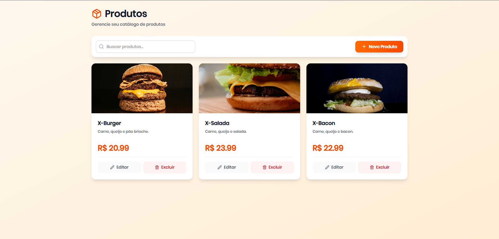

# 🍔 xLanches - Sistema de Gerenciamento de Lanchonete


Sistema completo de gerenciamento para lanchonetes com frontend moderno e backend robusto. Desenvolvido com as melhores práticas de desenvolvimento web.

---

## 📋 Sobre o Projeto

O **xLanches** é uma aplicação full-stack para gerenciamento de lanchonetes, permitindo o cadastro de produtos, autenticação de usuários e área administrativa restrita.

### ✨ Funcionalidades

- 🏠 **Página Inicial** - Landing page atrativa com informações da lanchonete
- 🔐 **Sistema de Login** - Autenticação de usuários (ADMIN e USER)
- 📦 **CRUD de Produtos** - Gerenciamento completo de produtos (apenas ADMIN)
- 👤 **Perfil de Usuário** - Dropdown com informações do usuário logado
- 🎨 **Design Responsivo** - Interface moderna e adaptável a todos os dispositivos
- 🔒 **Área Restrita** - Controle de acesso baseado em roles

---

## 🛠️ Tecnologias Utilizadas

### Backend

- **Java 17+**
- **Spring Boot 3.x**
- **Spring Data JPA** - Persistência de dados
- **Spring Web** - API REST
- **H2 Database** - Banco de dados em memória (desenvolvimento)
- **Lombok** - Redução de código boilerplate
- **Maven** - Gerenciamento de dependências

### Frontend

- **React 18** - Biblioteca JavaScript para UI
- **Vite** - Build tool e dev server
- **JavaScript (ES6+)**
- **TailwindCSS** - Framework CSS utility-first
- **React Router DOM** - Navegação entre páginas
- **Context API** - Gerenciamento de estado global

---

## 📁 Estrutura do Projeto

```
xLanches/
├── backend/
│   ├── src/
│   │   ├── main/
│   │   │   ├── java/com/xLanche/
│   │   │   │   ├── controller/
│   │   │   │   │   ├── ProdutoController.java
│   │   │   │   │   └── UsuarioController.java
│   │   │   │   ├── model/
│   │   │   │   │   ├── Produto.java
│   │   │   │   │   └── Usuario.java
│   │   │   │   ├── repository/
│   │   │   │   │   └── ProdutoRepository.java
│   │   │   │   ├── service/
│   │   │   │   │   └── ProdutoService.java
│   │   │   │   └── XLancheApplication.java
│   │   │   └── resources/
│   │   │       ├── application.properties
│   │   │       └── data.sql
│   │   └── test/
│   └── pom.xml
│
└── frontend/
    ├── src/
    │   ├── components/
    │   │   ├── Header.jsx
    │   │   ├── Section.jsx
    │   │   ├── Cardapio.jsx
    │   │   ├── About.jsx
    │   │   ├── CTA.jsx
    │   │   └── Footer.jsx
    │   ├── pages/
    │   │   ├── Home.jsx
    │   │   ├── Login.jsx
    │   │   └── Products.jsx
    │   ├── context/
    │   │   └── AuthContextCreate.jsx
    │   ├── App.jsx
    │   ├── main.jsx
    │   └── index.css
    ├── package.json
    ├── vite.config.js
    └── tailwind.config.js
```

---

## 🚀 Como Executar o Projeto

### Pré-requisitos

- **Java 17+** instalado
- **Node.js 18+** e **npm** instalados
- **Maven** (ou usar o wrapper incluído)
- **Git** para clonar o repositório

### 1️⃣ Clonar o Repositório

```bash
git clone https://github.com/seu-usuario/xlanches.git
cd xlanches
```

### 2️⃣ Configurar e Executar o Backend

```bash
# Navegar para a pasta do backend
cd backend

# Executar com Maven (Windows)
mvnw spring-boot:run

# Executar com Maven (Linux/Mac)
./mvnw spring-boot:run

# Ou se tiver Maven instalado globalmente
mvn spring-boot:run
```

O backend estará rodando em: **http://localhost:8080**

### 3️⃣ Configurar e Executar o Frontend

```bash
# Navegar para a pasta do frontend (em outro terminal)
cd frontend

# Instalar dependências
npm install

# Executar em modo de desenvolvimento
npm run dev
```

O frontend estará rodando em: **http://localhost:5173**

---

## 🔑 Credenciais de Teste

### Administrador

- **Email:** `edney@xlanches.com`
- **Senha:** `123`
- **Permissões:** Acesso total ao CRUD de produtos

### Usuário Comum

- **Email:** `maria@xlanches.com`
- **Senha:** `456`
- **Permissões:** Acesso limitado (sem área administrativa)

---

## 📡 Endpoints da API

### Produtos

| Método | Endpoint             | Descrição                  |
| ------ | -------------------- | -------------------------- |
| GET    | `/api/produtos`      | Lista todos os produtos    |
| GET    | `/api/produtos/{id}` | Busca produto por ID       |
| POST   | `/api/produtos`      | Cria novo produto          |
| PUT    | `/api/produtos/{id}` | Atualiza produto existente |
| DELETE | `/api/produtos/{id}` | Remove produto             |

### Usuários

| Método | Endpoint              | Descrição               |
| ------ | --------------------- | ----------------------- |
| GET    | `/api/usuarios`       | Lista todos os usuários |
| POST   | `/api/usuarios/login` | Realiza login           |

### Exemplo de Requisição - Criar Produto

```json
POST /api/produtos
Content-Type: application/json

{
  "nome": "X-Burger Especial",
  "descricao": "Hambúrguer artesanal com queijo cheddar e bacon",
  "preco": 28.90,
  "imagemUrl": "https://exemplo.com/burger.jpg"
}
```

### Exemplo de Requisição - Login

```json
POST /api/usuarios/login
Content-Type: application/json

{
  "email": "edney@xlanches.com",
  "senha": "123"
}
```

---

## 🎨 Identidade Visual

O projeto utiliza uma paleta de cores laranja vibrante:

- **Cor Primária:** `#ff7a3b` (Laranja)
- **Cor Secundária:** `#ffffff` (Branco)
- **Texto Escuro:** `#1a1a1a`
- **Background Claro:** `#fff7f2`

---

## 📸 Screenshots

> **Nota:** Adicione prints do seu projeto aqui

### Página Inicial


### Tela de Login


### CRUD de Produtos (Admin)



---

## 🔧 Configurações Adicionais

### Banco de Dados

O projeto está configurado para usar **H2 Database** em modo de memória para desenvolvimento.

Para acessar o console do H2:

- URL: http://localhost:8080/h2-console
- JDBC URL: `jdbc:h2:mem:xlanchedb`
- User: `sa`
- Password: _(deixe em branco)_

### Migrar para MySQL (Produção)

1. Adicione a dependência no `pom.xml`:

```xml
<dependency>
    <groupId>com.mysql</groupId>
    <artifactId>mysql-connector-j</artifactId>
    <scope>runtime</scope>
</dependency>
```

2. Configure o `application.properties`:

```properties
spring.datasource.url=jdbc:mysql://localhost:3306/xlanches
spring.datasource.username=seu_usuario
spring.datasource.password=sua_senha
spring.jpa.hibernate.ddl-auto=update
spring.jpa.properties.hibernate.dialect=org.hibernate.dialect.MySQLDialect
```

---

## 🤝 Contribuindo

Contribuições são sempre bem-vindas!

1. Fork o projeto
2. Crie uma branch para sua feature (`git checkout -b feature/AmazingFeature`)
3. Commit suas mudanças (`git commit -m 'Add some AmazingFeature'`)
4. Push para a branch (`git push origin feature/AmazingFeature`)
5. Abra um Pull Request

---

## 📝 Licença

Este projeto está sob a licença MIT. Veja o arquivo [LICENSE](LICENSE) para mais detalhes.

---

## 👨‍💻 Autor

**Edney Fagundes**

- GitHub: https://github.com/edneyzl
- LinkedIn: https://linkedin.com/in/edney-fagundes
- Email: edney.nextel2007@gmail.com

---

## 🙏 Agradecimentos

- [Spring Initializr](https://start.spring.io) - Geração do projeto base
- [Vite](https://vitejs.dev) - Build tool incrível
- [TailwindCSS](https://tailwindcss.com) - Framework CSS
- [React Icons](https://react-icons.github.io/react-icons/) - Biblioteca de ícones
- Comunidade open-source por todas as ferramentas fantásticas

---

<div align="center">

### ⭐ Se este projeto te ajudou, considere dar uma estrela!

**Desenvolvido com ❤️ e ☕**

</div>
